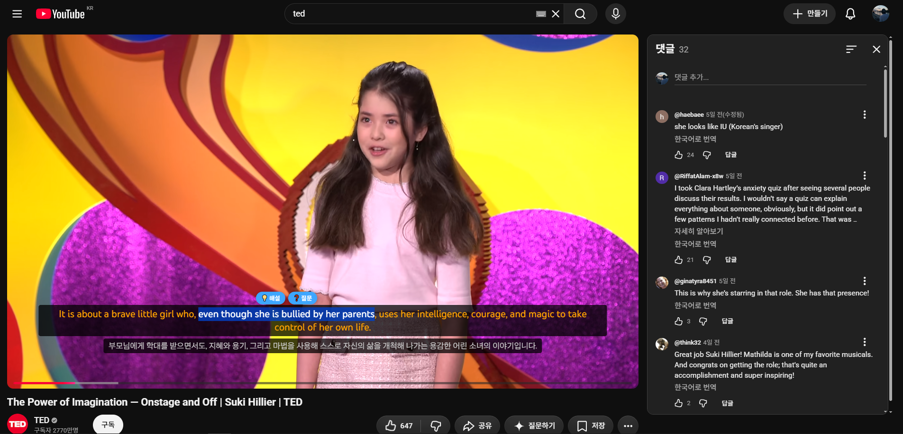
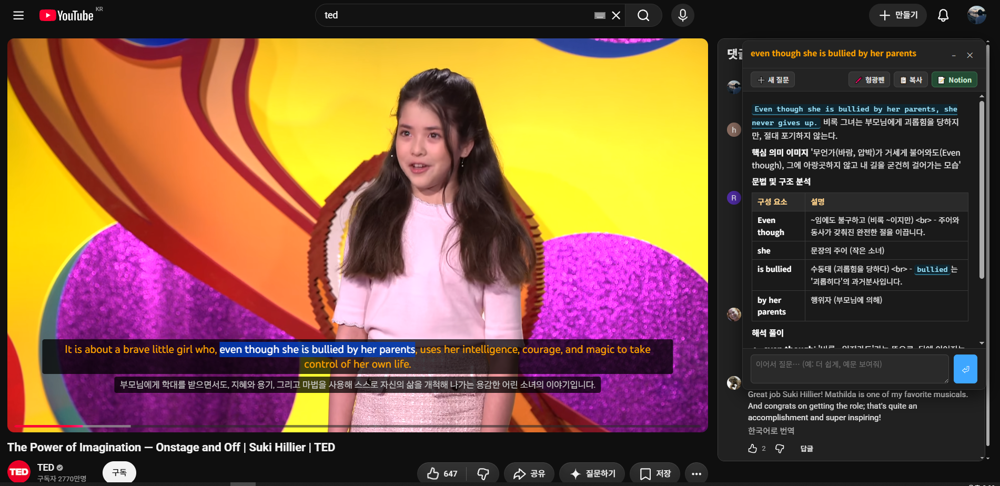
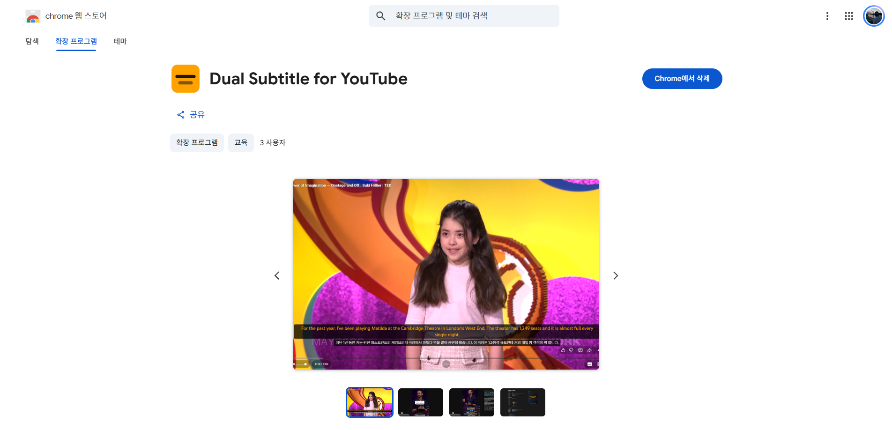

# Dual Subtitle for YouTube

YouTube 영상에 **원문 + 번역 자막을 동시에** 표시하는 Chrome 확장. 일반 영상과 Shorts 모두 지원. 자동자막(ASR)에는 단어 단위 점진 표시(노래방형) 옵션 제공.

## 스크린샷

| 드래그로 해설/질문 호출 | AI 해설 패널 (문법 분석·표) | Chrome 웹 스토어 등록 |
|---|---|---|
|  |  |  |

## 주요 기능

- 원문 자막(영어 등) + 번역 자막(한국어 등) 듀얼 표시
- 표시 모드: 듀얼 / 번역만 / 원문만
- 싱글 자막(번역만·원문만·모국어 영상) 누적 표시 — 현재 줄 + 직전 줄을 함께 쌓아 맥락 보강 (1~3줄)
- 단어 단위 점진 표시 (자동자막에서 가장 정확)
- 번역 백엔드 선택
  - **Google 무료**: 클라우드 번역, 품질 상위
  - **Chrome 내장**: 로컬 모델, 오프라인·프라이버시
  - **Gemini (BYOK)**: 본인 Google AI Studio 키로 AI 번역. 더 자연스러운 한국어, Flash·Flash-Lite 모델 선택
  - **Mindlogic Gateway (BYOK)**: 학교/조직 발급 키 하나로 Claude Haiku · GPT-5.4 mini/nano · Gemini Flash 등 가성비 라인 선택. 통합 크레딧 방식 게이트웨이
- 자막 위치를 마우스 드래그로 직접 조정 (일반/Shorts 좌표 별도 저장)
- 스타일 커스터마이즈: 폰트 크기·색·굵기·줄 높이·배경 투명도
- Shorts 자막 크기 배율 별도 조정
- 번역 캐시 (영상별 30일 / 200개 한도, 자동 정리)
- 단축키 `V` 듀얼자막 토글(`C`는 YouTube 네이티브 자막 토글 그대로) · `Alt+Q` AI에게 직접 질문 — 유튜브뿐 아니라 어느 웹사이트에서도 (자막에 없는 표현도 물어보기)

## 설치

### Chrome Web Store

_등록 후 링크 추가 예정._

### 개발자 모드 (수동 로드)

1. 이 저장소를 clone
2. Node.js 22+ 설치
3. 빌드
   ```bash
   npm install
   npm run build
   ```
4. Chrome 주소창에 `chrome://extensions` 입력
5. 우측 상단 **개발자 모드** ON
6. **압축해제된 확장 프로그램을 로드** → `dist/` 폴더 선택

## 개발

```bash
npm run dev       # Vite dev server (CRX HMR)
npm run build     # production 빌드 → dist/
npm run typecheck # tsc --noEmit
```

dev 빌드는 디버그 콘솔 로그(`[YDT/...]`) 유지. production 빌드는 자동 제거.

## 권한

| 권한 | 용도 |
|---|---|
| `storage` | 사용자 설정 sync + 번역 캐시 |
| `scripting` | YouTube 페이지에 content script 주입 |
| `offscreen` | Chrome 내장 Translator API 실행 |
| `host: youtube.com` | 자막 트랙 가로채기 + 자막 오버레이 |
| `host: translate.googleapis.com` | Google 무료 백엔드 호출 |
| `host: generativelanguage.googleapis.com` | Gemini (BYOK) 백엔드 호출. 사용자가 본인 키 입력 시에만 사용 |
| `host: factchat-cloud.mindlogic.ai` | Mindlogic Gateway (BYOK) 백엔드 호출. 사용자가 학교/조직 키 입력 시에만 사용 |

데이터 처리 상세는 [docs/PRIVACY.md](docs/PRIVACY.md) 참고.

## 라이선스

MIT — [LICENSE](LICENSE) 참고.

## 기여

이슈와 PR 환영합니다: <https://github.com/mw3love/youtube_dual_subtitle/issues>
